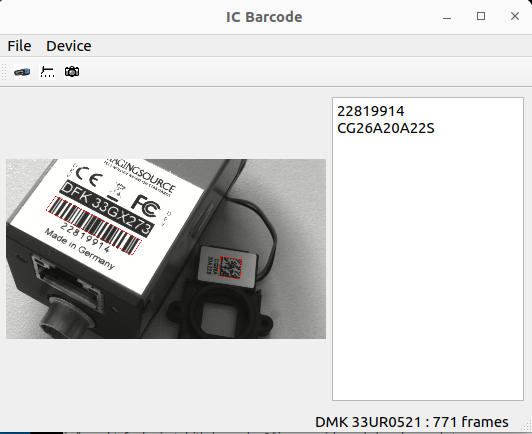

# tiscamera IC Barcode Demo 

This sample demonstrates how to use the The Imaging Source Barcode Library from [IC Barcode for AMD 64](https://www.theimagingsource.com/en-us/support/download/tisicbarcode-1.1.0.703/) or [IC Barcode for ARM 64](https://www.theimagingsource.com/en-us/support/download/tisicbarcodearm-1.1.0.703/) in a Qt based C++ program.

## Prerequisites
- IC Barcode library (see above)
- C++
- tiscamera 1.1.n from [Releases](https://github.com/TheImagingSource/tiscamera/releases/tag/v-tiscamera-1.1.1)
- tiscamera dev packages from [Releases](https://github.com/TheImagingSource/tiscamera/releases/tag/v-tiscamera-1.1.1) 
- Qt dev packages
- A The Imaging Source video capture device from [here](https://www.theimagingsource.com)

## Building
After all above mentioned packages have been installed, the demo is built with
```shell
mkdir build
cd build 
cmake ..
make
```
## Execution
```shell
cd build 
./ICBarcode
```
## Usage
### Device selection
Click on the "Device" menu an select "Select". That opens the device selection dialog:


After a device is selected, it is started and barcodes can be scanned:


On the image is a Code128 and a Datamatrix Code. Both can be scanned on the same image. They are also position invariant. 

### Device Properties
This sample contains a properties dialog for setting all properties:


The device selection and the device properties dialogs are in the ``tcamcamera`` subdirectory. This can be used in your own software.

## Source Code
### Choosing barcodes to detect
The barcode to be detected can be specified as follows:
```C++
	int formats = 0;
	formats |= ICBarcode_Format::IC_BARCODEFORMAT_CODE_128;
	formats |= ICBarcode_Format::IC_BARCODEFORMAT_CODE_93;
	formats |= ICBarcode_Format::IC_BARCODEFORMAT_EAN_13;
	formats |= ICBarcode_Format::IC_BARCODEFORMAT_EAN_8;
	formats |= ICBarcode_Format::IC_BARCODEFORMAT_UPC_A;
	formats |= ICBarcode_Format::IC_BARCODEFORMAT_QR_CODE;
    formats |= ICBarcode_Format::IC_BARCODEFORMAT_DATA_MATRIX;
	//formats |= ICBarcode_Format::IC_BARCODEFORMAT_INTERLEAVED_2_OF_5;
	//formats |= ICBarcode_Format::IC_BARCODEFORMAT_CODE_39;
    
	ICBarcode_SetBarcodeFormats(_callback_user_data.pIC_BarcodeScanner, formats);
```
The shorter the list, the faster is the detection. 

### Multithreading and events
Gstreamer runs in a different thread, than the QT GUI. Therefore, the barcode results will be passed by an event structure to the GUI mainthread. For this, the event handler and classes are defined in ``mainwindow.h``

### Graphic Overlay
The graphical display of a red frame around the overlay is done with the GSteamer [rsvgoverlay](https://gstreamer.freedesktop.org/documentation/rsvg/rsvgoverlay.html?gi-language=c) element. It receives an XML string which contains the graphic description.

## Questions and Contact
For questions please contact us at https://www.theimagingsource.com/en-us/company/contact/. 

